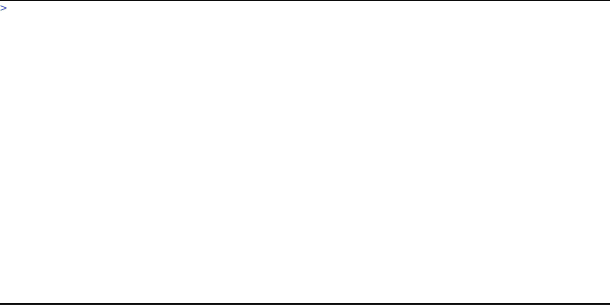

# YAMLcast

YAMLcast turns a YAML description of a terminal screencast into an animated GIF.

It translates the YAML into a [VHS](https://github.com/charmbracelet/vhs)
`.tape` script and invokes `vhs` to render it.
The translator is a single YAMLScript program at `bin/yamlcast`.



## Requirements

YAMLcast bootstraps everything it needs into `./.cache/`:

- [Makes](https://github.com/makeplus/makes) for the build system.
- [YAMLScript](https://yamlscript.org) (`ys-0`) for running `bin/yamlcast`.
- [Go](https://go.dev) for building `vhs`.
- [VHS](https://github.com/charmbracelet/vhs) for rendering the GIF.

You only need a working `bash`, `git`, `make`, and `curl` on your `PATH`.

## Setup

Source the project's `.rc` file once per shell session.
This sets `YAMLCAST_ROOT` and adds `bin/` to your `PATH`:

```
source .rc
```

`bin/yamlcast` will refuse to run unless `YAMLCAST_ROOT` is set.

## Usage

Generate the example GIF:

```
yamlcast example.yaml
```

Print the generated `.tape` without invoking `vhs`:

```
yamlcast --dry-run example.yaml
```

On the first real (non-dry-run) invocation, Go and VHS are installed into
`./.cache/local/` automatically.

## Input format

A YAMLcast input file is a map.
The recognized top-level keys are:

- `output` (optional): the output GIF file name.
  If omitted, defaults to the input file name with its `.yaml` or `.yml`
  extension replaced by `.gif` (so `foo.yaml` produces `foo.gif`).
- `steps` (optional sequence): the actions to record.
- Any other top-level key is treated as a VHS `Set` directive.
  Keys use `snake_case` and are converted to VHS's `PascalCase` automatically
  (for example, `font_size` becomes `FontSize`).

Each step is one of:

- A single-key mapping.
  Supported keys: `type`, `sleep`, `enter`, `image`, `tab`, `backspace`,
  `space`, `hide`, `show`, `screenshot`, `ctrl`, `source`, `require`,
  `wait`, `bg_color`.
  `enter` may take an optional text value; the text is typed and then
  `Enter` is pressed.
  `image` takes a path; the image is rendered in the cast terminal with
  `yc-image`, with the typing of the command hidden.
  `wait` takes a regex; recording blocks for up to 30 seconds until the
  pattern appears anywhere on the visible screen.
  `bg_color` takes a hex color (with or without a leading `#`) and
  changes the terminal background mid-cast.
- A bare ALL-CAPS string (e.g. `CLEAR`, `ENTER`, `CTRL+L`): emits the
  matching VHS key command with no typing.
  `RESET` is a special case: it re-emits every top-level setting,
  reverting any mid-cast overrides (such as `bg_color`) back to the
  baseline.
- A bare string that names an existing file (short form for `image:`): the
  file is rendered as an image.
- Any other bare string (short form for `enter:`): the string is typed and
  `Enter` is pressed.
- A bare number (short form for `sleep:`): sleep for that many
  milliseconds.

Inside a `type:` value, bracketed tokens like `<ENTER>`, `<TAB>`,
`<BACKSPACE>`, `<SPACE>`, `<UP>`, `<DOWN>`, `<LEFT>`, `<RIGHT>`, and
`<CTRL+C>` are expanded into the corresponding VHS key commands.

See [`example.yaml`](example.yaml) for a working example.

## Make targets

- `make test` runs `bin/yamlcast --dry-run example.yaml`.
- `make vhs-path` prints the path to the locally-installed `vhs`, installing
  Go and VHS first if needed.
- `make shell cmd='<command>'` runs `<command>` inside the Makes environment.

## Copyright and License

Copyright 2026 Ingy döt Net

This project is licensed under the MIT License.
See the [License](License) file for details.
